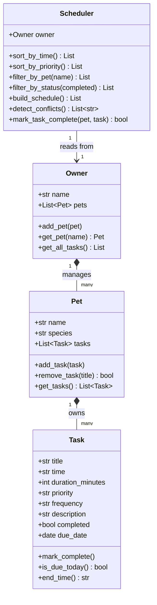

# PawPal+ (Module 2 Project)

You are building **PawPal+**, a Streamlit app that helps a pet owner plan care tasks for their pet.

## Scenario

A busy pet owner needs help staying consistent with pet care. They want an assistant that can:

- Track pet care tasks (walks, feeding, meds, enrichment, grooming, etc.)
- Consider constraints (time available, priority, owner preferences)
- Produce a daily plan and explain why it chose that plan

Your job is to design the system first (UML), then implement the logic in Python, then connect it to the Streamlit UI.

## What you will build

Your final app should:

- Let a user enter basic owner + pet info
- Let a user add/edit tasks (duration + priority at minimum)
- Generate a daily schedule/plan based on constraints and priorities
- Display the plan clearly (and ideally explain the reasoning)
- Include tests for the most important scheduling behaviors

## Getting started

### Setup

```bash
python -m venv .venv
source .venv/bin/activate  # Windows: .venv\Scripts\activate
pip install -r requirements.txt
```

### Suggested workflow

1. Read the scenario carefully and identify requirements and edge cases.
2. Draft a UML diagram (classes, attributes, methods, relationships).
3. Convert UML into Python class stubs (no logic yet).
4. Implement scheduling logic in small increments.
5. Add tests to verify key behaviors.
6. Connect your logic to the Streamlit UI in `app.py`.
7. Refine UML so it matches what you actually built.

## Project structure

```
pawpal_system.py   # Core logic — Task, Pet, Owner, Scheduler classes
app.py             # Streamlit UI (imports from pawpal_system)
main.py            # CLI demo — run `python main.py` to verify logic in terminal
tests/
  test_pawpal.py   # pytest suite
reflection.md      # Design decisions and AI-collaboration notes
```

### Running the app

```bash
streamlit run app.py
```

### Running the CLI demo

```bash
python main.py
```

### Running tests

```bash
python -m pytest
```

---

## System design (UML)



---

## Smarter Scheduling

PawPal+ goes beyond a simple to-do list with four algorithmic features:

### 1. Priority-first ordering
`Scheduler.sort_by_priority()` sorts tasks by `high → medium → low`, then by start time within each tier. `build_schedule()` uses this ordering so the most critical tasks (medications, meals) always appear first, regardless of when they're scheduled.

### 2. Recurring task management
Tasks have a `frequency` field (`once / daily / weekly`). Calling `mark_complete()` on a recurring task does **not** mark it as permanently done — it advances the `due_date` by 1 day or 7 days respectively, so the task automatically resurfaces the next time it's due. One-off tasks (`once`) are permanently closed.

### 3. Overlap-aware conflict detection
`Scheduler.detect_conflicts()` checks whether any task's start time falls inside another task's active window (using `Task.end_time()`). Conflicts are surfaced as warning messages in the UI rather than blocking the schedule, because some overlaps are valid (two pets, two carers).

### 4. Due-date filtering
`build_schedule()` only includes tasks where `due_date ≤ today`. Future tasks and just-completed recurring tasks (whose due date has been advanced) are automatically excluded from the day's plan, keeping the view clean.
