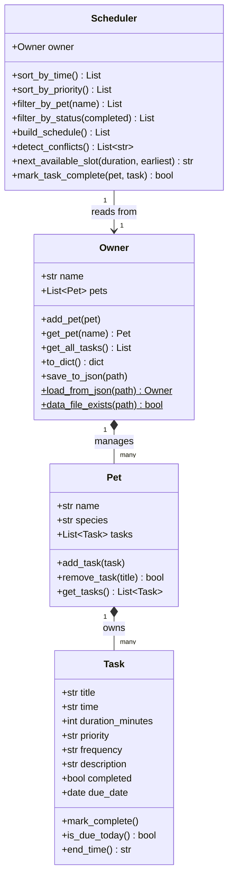

# PawPal+ (Module 2 Project)

You are building **PawPal+**, a Streamlit app that helps a pet owner plan care tasks for their pet.

## Scenario

A busy pet owner needs help staying consistent with pet care. They want an assistant that can:

- Track pet care tasks (walks, feeding, meds, enrichment, grooming, etc.)
- Consider constraints (time available, priority, owner preferences)
- Produce a daily plan and explain why it chose that plan

Your job is to design the system first (UML), then implement the logic in Python, then connect it to the Streamlit UI.

## What you will build

Your final app should:

- Let a user enter basic owner + pet info
- Let a user add/edit tasks (duration + priority at minimum)
- Generate a daily schedule/plan based on constraints and priorities
- Display the plan clearly (and ideally explain the reasoning)
- Include tests for the most important scheduling behaviors

## Getting started

### Setup

```bash
python -m venv .venv
source .venv/bin/activate  # Windows: .venv\Scripts\activate
pip install -r requirements.txt
```

### Suggested workflow

1. Read the scenario carefully and identify requirements and edge cases.
2. Draft a UML diagram (classes, attributes, methods, relationships).
3. Convert UML into Python class stubs (no logic yet).
4. Implement scheduling logic in small increments.
5. Add tests to verify key behaviors.
6. Connect your logic to the Streamlit UI in `app.py`.
7. Refine UML so it matches what you actually built.

## Features

| Feature | Description |
|---|---|
| **Multi-pet support** | Add as many pets as needed; all tasks are managed under one owner |
| **Priority-first scheduling** | High → Medium → Low ordering within each time slot |
| **Recurring tasks** | Daily and weekly tasks auto-advance their due date on completion |
| **Overlap-aware conflict detection** | Flags tasks whose time windows overlap; warns without blocking |
| **Next-available-slot suggestion** | Auto-suggests the first gap in the schedule that fits a new task's duration |
| **Data persistence** | State is saved to `data.json` after every action and reloaded on startup |
| **Due-date filtering** | Only today's tasks appear in the schedule; future and completed recurring tasks are excluded |

## 📸 Demo

<a href="/course_images/ai110/pawpal_screenshot.png" target="_blank"></a>

## Project structure

```
pawpal_system.py   # Core logic — Task, Pet, Owner, Scheduler classes
app.py             # Streamlit UI (imports from pawpal_system)
main.py            # CLI demo — run `python main.py` to verify logic in terminal
data.json          # Auto-generated; persists owner/pet/task state between runs
tests/
  test_pawpal.py   # pytest suite (47 tests)
reflection.md      # Design decisions and AI-collaboration notes
```

### Running the app

```bash
streamlit run app.py
```

### Running the CLI demo

```bash
python main.py
```

### Running tests

```bash
python -m pytest
```

---

## System design (UML)



---

## Smarter Scheduling

PawPal+ goes beyond a simple to-do list with four algorithmic features:

### 1. Priority-first ordering
`Scheduler.sort_by_priority()` sorts tasks by `high → medium → low`, then by start time within each tier. `build_schedule()` uses this ordering so the most critical tasks (medications, meals) always appear first, regardless of when they're scheduled.

### 2. Recurring task management
Tasks have a `frequency` field (`once / daily / weekly`). Calling `mark_complete()` on a recurring task does **not** mark it as permanently done — it advances the `due_date` by 1 day or 7 days respectively, so the task automatically resurfaces the next time it's due. One-off tasks (`once`) are permanently closed.

### 3. Overlap-aware conflict detection
`Scheduler.detect_conflicts()` checks whether any task's start time falls inside another task's active window (using `Task.end_time()`). Conflicts are surfaced as warning messages in the UI rather than blocking the schedule, because some overlaps are valid (two pets, two carers).

### 4. Due-date filtering
`build_schedule()` only includes tasks where `due_date ≤ today`. Future tasks and just-completed recurring tasks (whose due date has been advanced) are automatically excluded from the day's plan, keeping the view clean.

### 5. Next-available-slot suggestion (Challenge 1)
`Scheduler.next_available_slot(duration_minutes)` scans existing time windows in chronological order and returns the first gap wide enough to fit a new task without overlap. The Streamlit UI pre-fills the time input with this suggestion whenever a duration is entered.

### 6. Data persistence (Challenge 2)
`Owner.save_to_json()` and `Owner.load_from_json()` serialise the full object graph (owner → pets → tasks, including `date` fields) to `data.json`. The Streamlit app auto-saves after every mutation and reloads on startup, so no data is lost between browser refreshes or app restarts.

---

## Testing PawPal+

```bash
python -m pytest          # run all tests
python -m pytest -v       # verbose output with test names
```

The test suite (`tests/test_pawpal.py`) covers:

| Area | What is verified |
|---|---|
| Task completion | `once` tasks close permanently; `daily`/`weekly` tasks advance due date and stay active |
| End-time arithmetic | `end_time()` computes correctly, including hour-crossing cases |
| Due-date logic | Overdue tasks are still shown; future tasks are excluded |
| Pet task management | `add_task`, `remove_task`, task count integrity |
| Owner aggregation | `get_all_tasks` collects across all pets |
| Scheduler sorting | Chronological and priority ordering |
| Scheduler filtering | By pet name and by completion status |
| Conflict detection | Overlapping windows flagged; adjacent windows pass cleanly |
| `build_schedule` | Only due tasks included |
| Persistence round-trip | `save_to_json` → `load_from_json` preserves all fields including dates |
| Next-available-slot | Returns correct gap; skips gaps too small; falls back to after last task |

**Confidence: ★★★★☆** — All 47 tests pass. Core scheduling logic is thoroughly covered. Known gap: tasks spanning midnight (e.g., `23:30` + 90 min) would produce an invalid `end_time` string; this edge case is documented but not yet handled.
